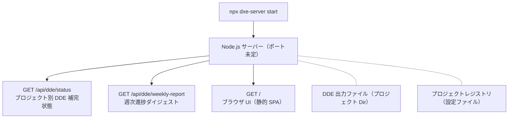

[English version](architecture.md)

# dxe-server — アーキテクチャ

> **ステータス**: 設計フェーズ。実行可能なコードはまだありません。`bin/dxe-server.js` は存在しません。

---

## コンポーネント責務

dxe-server は DxE ツールキットスイートの**任意の可視化アドオン**です。想定される責務：

| 責務 | オーナー |
|---|---|
| DDE ドキュメント補完状態の可視化 | **dxe-server**（対象） |
| 週次ダイジェストレポート（DDE 進捗の時系列） | **dxe-server**（対象） |
| 決定グラフ（Session → Gap → DD → Spec） | **DVE**（実装済み） |
| DRE インストール状態（FRESH/INSTALLED/OUTDATED/CUSTOMIZED） | **DVE**（`state-detector.ts` で実装済み） |
| マルチプロジェクトスキャン（`/api/scan`） | **DVE**（実装済み） |
| Preact + Cytoscape Web UI | **DVE**（実装済み） |
| rules/skills の配布・適用 | **DRE** |
| 設計Gap抽出 | **DGE** |

dxe-server が DRE 状態やマルチプロジェクトスキャンをカバーすべきかどうかは**未解決**です。[ADR-002](decisions/ADR-002-scope-options.md) を参照してください。

---

## 想定アーキテクチャ（実装後）

**未決定**: このサーバーが常駐（デーモン）か一時的（オンデマンド `npx`）かは未定です。

---

## DVE との境界

DVE（Decision Visualization Engine、DxE-suite の一部）は DxE スイートの主要な可視化ツールです。`localhost:4174` で動作し、以下を提供します：

- Session、Gap、DD、Spec のすべてを Preact + Cytoscape でグラフ表示
- ディスク上の DxE 対応プロジェクトを発見する `/api/scan` エンドポイント
- `state-detector.ts` — プロジェクト別の DRE インストール状態を検出
- アノテーション書き戻し API

**dxe-server は DVE の既存機能を重複実装してはいけません。**

重複しない機会は **DDE の可視化**です — DVE はプロジェクトに `hasDDE: true`（ブール値）を記録しますが、DDE の内部補完状態は可視化しません：どのページが完了か、どの用語がリンク済みか、どの Gap が未解決か。

---

## 将来の DDE 可視化スコープ

DDE は現在可視化されていない以下のデータを生成します：

| DDE アーティファクト | 場所 | 現在の可視性 |
|---|---|---|
| 用語抽出結果 | `dde/terms/` | なし |
| 生成済み記事 | `dde/articles/` | なし |
| 自動リンク済みドキュメントページ | ソースドキュメント | 部分的（差分のみ） |
| 補完率 | —（ファイル未定） | なし |
| 欠落グロサリーリンク | —（ファイル未定） | なし |

DDE 可視化ストーリーが dxe-server の**主要な差別化ポイント**です。

---

## 未解決事項

1. **Critical Gap #2** — マルチプロジェクト横断集約がサーバーの核心的価値です。単一プロジェクトのユーザーは `dde status` CLI 出力で同等の価値を得られます。実装を始める前にサーバーのビジネスケースを確立する必要があります。

2. **Critical Gap #3** — 誰がいつどのくらいの頻度で使うか？
   - 毎日: 常駐デーモン + 変更通知が必要
   - 週次: オンデマンド `npx dxe-server start` で十分
   - 単発: `dxe status` CLI 出力でサーバーを完全に代替できる

3. **ADR-002 未解決** — 3つのオプションが残っています。[ADR-002](decisions/ADR-002-scope-options.md) を参照してください。

---

## 関連ドキュメント

- [relationship-with-dve-ja.md](relationship-with-dve-ja.md) — DVE 重複分析の詳細
- [decisions/ADR-001-separate-package.md](decisions/ADR-001-separate-package.md) — dxe-server をスタンドアロンパッケージにした理由
- [decisions/ADR-002-scope-options.md](decisions/ADR-002-scope-options.md) — 未解決のスコープ決定
- [../design-materials/intake/initial-design.md](../design-materials/intake/initial-design.md) — 元の DGE セッション
