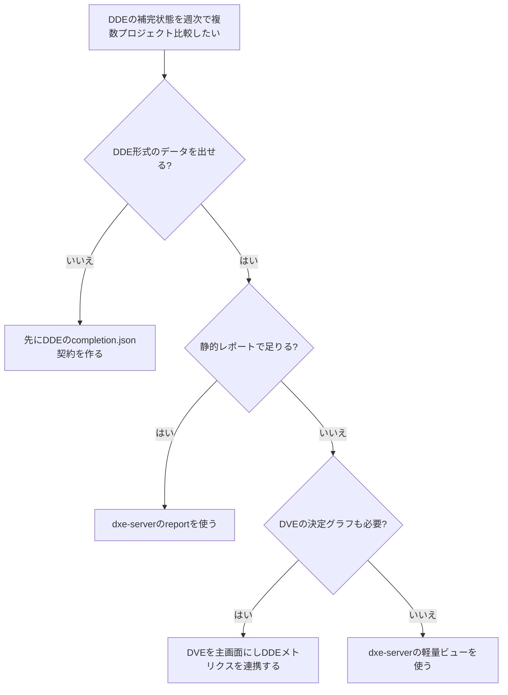

# dxe-server 市場調査

調査日: 2026-07-31。比較対象の採用状況は同日確認。GitHub の star 数は変動するため、すべて参照日付きで記載する。

## 0. 要約

立ち位置: DVEが扱わないDDEの補完率・用語リンク・時系列・週次レポートだけを扱う、DxE-suite向けの狭いアドオン候補である。

最大の弱点: 現在はscaffoldで実行コードがなく、補完サマリー形式・利用者・複数プロジェクト価値も未確定なので、比較対象に対する選択理由をまだ実証できない。

次の一手: サーバーを先に作らず、DDEの機械可読な`completion.json`と静的Markdownレポートを最小実装し、複数プロジェクトで週次利用されるかを検証する。

## 1. このrepoは何か

一言でいえば、DDE（ドキュメントGap発見・補完）の状態を複数プロジェクト横断で見せ、週次ダイジェストを出す予定のローカルサービスである。`package.json`は`npx dxe-server start`というCLIエントリを宣言しているが、`bin/dxe-server.js`は存在しない。

提供価値は、DDEが生成する用語・記事・リンク・補完状態を人がファイル単位で確認する手間を、プロジェクト別の集計、未完了項目、補完率の推移、週次レポートに変えることにある。ただし、現行コードにはデータ収集・集計・UI・レポートの実装はない。

想定利用者は、複数プロジェクトでDxE-suite/DDEを運用し、週次にドキュメント整備の進捗を確認する開発者またはチームリードである。単一プロジェクトの単発確認ならDDE CLI出力で代替できる、とREADMEと設計書自身が記載している。

比較単位はdxe-serverパッケージ単体ではない。実際の価値は「DDEが状態を作る → dxe-serverが複数プロジェクトを集計 → 人がブラウザまたはレポートで改善箇所を選ぶ」という組み合わせにある。したがって、比較対象はMarkdown変換ライブラリではなく、開発者向けドキュメントを登録・公開・検索・維持・観測する製品群とした。

到達点の客観指標は、公開バージョン`0.1.0`、実行可能コード0、`bin`の実体なし、テストスクリプトなし、`package.json`の実行依存なし、MITライセンスである。README・アーキテクチャ文書・SPECは設計資料であり、稼働URLや最終リリース済み機能は確認できない。

## 1.5 調査の型

`target_type: service`とした。利用者が欲しいのはAPIライブラリではなく、DDEの状態を登録済みプロジェクトから読み、画面またはレポートで意思決定できるサービスだからである。実装予定はNode.jsサーバー＋ブラウザUIだが、現時点ではサービスを実際に起動できない。

serviceの比較軸は、機能、導入・運用、複数プロジェクト管理、ドキュメントの鮮度・品質を測る仕組み、レポート／通知、料金・ライセンス、既存エコシステムである。比較対象の公開docs・料金ページ・公開デモ相当のURLは実際に閲覧した。一方、認証が必要な各社の管理ダッシュボードを操作したわけではないため、confidenceは「中」とした。

## 2. 比較対象と選定理由

| 製品 | 何ができるか | 採用状況（2026-07-31確認） | ライセンス | うちとの決定的な違い | なぜ比較対象に選んだか |
|---|---|---|---|---|---|
| Backstage / TechDocs | ソフトウェアカタログ、サービス・所有者管理、docs-like-codeの技術文書ポータル | GitHub ★34.0k。GitHubページの最新活動を確認したが、最終コミットの具体日付は取得できず「日付不明」 | Apache-2.0 | ポータルとカタログが主役で、DDE固有の補完率・用語リンク・週次差分は標準機能ではない | 複数サービスと文書を一つの開発者ポータルに束ねる代表的OSS |
| Material for MkDocs | Markdownから検索可能でテーマ性のある静的ドキュメントサイトを生成 | GitHub ★27.1k、最終リリース9.7.1。リリースページではメンテナンスモードと確認 | MIT | 公開サイト生成が主で、プロジェクト横断の状態集計や週次進捗は持たない | 軽量・所有権重視のdocs-as-code代替。導入の軽さを比較できる |
| GitBook | Git同期、ブロック編集、公開、検索、AI、サイトInsights（トラフィック・ページ・検索等） | OSS renderer GitHub ★28.9k、最終更新は2026-05-27表示。クラウドは有料プランあり | クラウドはサービス契約、rendererはGPL-3.0 | 読者向け公開・利用分析が中心で、DDEの内部補完状態や開発中の未リンク用語は管理しない | 「文書を公開して改善する」サービスとして、分析・料金・運用面を比較できる |
| Mintlify | Git連携、MDXサイト、Web editor、API playground、AI agent/assistant、analytics | 公開docs repo GitHub ★400（2026-07-31確認）。サービスの最終更新日は不明 | プロプライエタリサービス。公開docs repoはMIT | 公開体験と読者検索の最適化が中心。DDEの完了判定や複数repoの内向き進捗集計は標準の主目的ではない | 開発者向けdocsを数分で公開する現代的SaaSの代表 |
| Swimm | コードに結び付いた開発者ドキュメント、CIでの更新検知・merge阻止、legacy codeのbackfill、AI | 公式サイトは「数千開発者・数千万行規模」「Fortune 500導入」と主張するが、公開star数は該当OSSなし（2026-07-31確認） | プロプライエタリ。オンプレミス／AIなしの提供を公式記載 | 変更されたコードとの整合性・CI enforcementが中心。dxe-serverのDDE成果物集計・週次レポートとは入力と責務が異なる | 「ドキュメントの鮮度・coverageを開発フローで維持する」点で最も近い商用候補 |

この地図は、単一の標準製品がある市場ではなく、重心が異なる5群である。Backstageはポータル、Material for MkDocsは静的公開、GitBook/MintlifyはSaaS公開と読者分析、Swimmはコードと文書の整合性に寄っている。今回確認した範囲では、DDEの内部補完状態を入力にして複数プロジェクトの週次差分を出す製品は見つからなかった。この空白は差別化候補だが、同時に「本当に誰が定期的に見るのか」が未検証という意味でもある。

## 3. ポジショニング

比較可能な全対象について同じ尺度の導入負荷・内部補完観測値が揃わなかったため、推測でquadrantChartは描かない。定性的には、dxe-serverは「公開サイトの完成度」ではなく「DDE内部状態の観測」に寄せるべき位置である。

## 4. 機能比較

凡例: ○=ある / △=部分的・要設定 / ×=確認できない・標準目的ではない。重み: ◎=この立ち位置で必須 / ○=効く / △=あれば良い / —=入れない。

| 機能 | 重み | dxe-server（計画） | Backstage/TechDocs | Material for MkDocs | GitBook | Mintlify | Swimm |
|---|---:|---|---|---|---|---|---|
| DDE固有の補完率・未完了ページを表示 | ◎ | ○（計画） | × | × | × | × | △（coverageは主張、DDE形式ではない） |
| 用語抽出・未リンク用語を扱う | ◎ | ○（計画） | × | × | × | × | × |
| 補完率の時系列・週次差分 | ◎ | ○（計画） | △（プラグイン／外部実装） | × | △（Insightsは読者利用分析） | △（analyticsは読者利用分析） | △（CI更新検知） |
| 複数プロジェクトを一つのビューで扱う | ◎ | ○（計画） | ○（カタログ） | × | △（サイト／スペース単位） | △（サイト／repo単位） | ○（エンタープライズ向け） |
| Markdown/Gitとの親和性 | ○ | ○（計画） | ○ | ○ | ○ | ○ | ○ |
| 公開ドキュメントサイト・検索 | ○ | △（内部UI想定） | ○ | ○ | ○ | ○ | △ |
| CIで鮮度を検証しマージを止める | ○ | ×（計画なし） | △（外部CI・プラグイン） | △（外部CI） | △（Git sync/CI連携） | △（PR preview/agent） | ○ |
| 静的Markdown/HTML週次レポート | ◎ | ○（計画） | ×（標準で確認できず） | × | ×（InsightsはUI） | ×（analyticsはUI） | △（CI通知・運用次第） |
| DVEの決定グラフを重複せず連携 | ◎ | ○（設計上DVEへ委譲） | × | × | × | × | × |
| オンデマンド導入 | ○ | ○（`npx`計画） | ×（基盤導入） | ○ | ×（SaaS） | ○（CLI/preview） | ×（商用導入） |

この表で痛い×は、公開サイトや検索ではなく、dxe-server自身の実装欠如である。計画上の差別化機能はほぼすべて○だが、まだ実証値ではない。逆にGit連携、検索、複数プロジェクト登録は既存製品がすでに強く、そこを広げても差別化になりにくい。勝負所は「DDEの機械可読な状態を、週次の行動につながる差分に変える」一点に絞られる。

## 4.5 コード・実装の比較

service比較のため、比較対象の管理画面コードや内部実装は読めない。このrepoも実行コードがないため、library/engine向けの公開API数・依存数・テスト量・配布サイズの公平な表は作れない。確認できた事実は、dxe-serverの実行依存が`package.json`上0、テストスクリプトが0、`bin/dxe-server.js`が未作成ということだけである。比較対象のOSSリポジトリはコードを読む対象ではなく、サービス選択肢として扱った。

## 5. 採用状況

全対象で同じ意味の採用数を取得できないため、採用状況グラフは描かない。GitHub starはOSSの関心の代理値にすぎず、Backstage・Material for MkDocs・GitBook rendererの規模は示せても、SaaSの有料導入数や実運用の成功を示さない。Swimmの公式導入主張も第三者の利用統計ではないため、starと同列に可視化しなかった。

## 5.5 調査者の見立て

本当の勝負所はUIではなく、DDEが出す状態の定義と、週次レポートが「次に直すページ・用語」を一つに絞れることである、と読める。既存製品は公開・検索・カタログ・コード整合性のどこかを解くが、DDE固有の完了モデルを持っていない。

数字に出ていない懸念は、DDE側のデータ契約が未定なままサーバーの境界だけが先行していることだ。入力がファイル名の寄せ集めなら、補完率の数字は簡単に作れても信頼できる指標にならない。DVEとの責務境界もADR-002が未決定である。

私なら、まずOption Cの静的レポートを作り、DDEの実データを3〜5プロジェクトから週次で読み、レポートを見て修正行動が生じるかを確認する。そこで需要が確認できた場合だけ、同じ集計コアをブラウザAPIへ切り出す。

この見立てが外れる条件は、DDE利用が単一プロジェクト・単発確認に留まること、またはDVEがDDE補完率と週次レポートを正式に吸収することである。その場合、サーバーは不要になり、DDE CLIまたはDVEの一画面で足りる。逆にSwimm等がDDE形式を直接取り込み、同じ週次運用を低コストで提供し始めても、ニッチ優位は消える。

## 6. 提案（優先順）

| 順 | 提案 | 分類 | 根拠 | 最小の一手 | 効きそうな指標 |
|---:|---|---|---|---|---|
| 1 | DDEと合意した`completion.json` v0を定義し、静的Markdownレポートを生成する | 埋める | ◎の入力と週次成果物が未実装。比較対象にも同じDDE状態はない | 1プロジェクトの固定fixtureから、補完率・未完了ページ・未リンク用語・前週差分を出す | レポート生成成功率、レポートを見て修正された項目数 |
| 2 | 3〜5プロジェクトを対象に週次利用の検証を行う | 伸ばす | 複数プロジェクト集約がサーバーの核心だが、README自身が未証明と認める | 設定ファイル列挙＋CIで週次レポートを保存し、利用者に「次に直す3項目」を聞く | 継続利用週数、プロジェクト数、週次レビュー所要時間 |
| 3 | DVEとはプロジェクト発見・DRE/DGEグラフを共有し、DDEメトリクスだけ担当する | 伸ばす | DVEがscan・決定グラフ・DRE状態を既に持ち、重複実装は不利 | DVE連携仕様を1ページに固定し、dxe-server側に同機能を追加しないテストを書く | 重複API数、DVEからDDEレポートへ遷移できる率 |
| 4 | レポートが示す「行動」から逆算して、未完了ページではなく優先順位を出す | 埋める | 公開SaaSのanalyticsは読者行動であり、DDEは作者の修正行動が必要 | 影響度・未リンク用語数・更新経過日を使った単純な説明可能スコアを出す | 推奨項目の修正率、誤推薦率、利用者の確認時間 |
| 5 | 汎用の公開docsサイト、AI検索、認証、常駐daemonを初期版に入れない | やらない | GitBook/Mintlify/Backstageが既に強く、DVEと責務が重なる。Gap #3も未解決 | Option CのCLI＋静的成果物に限定し、採用条件を満たすまで保留する | 初期実装期間、依存数、重複機能数、検証完了までの週数 |

「やらない」は機能不足ではなく、立ち位置を守るための判断である。公開サイトの美しさやAIアシスタントを追うと、既存SaaSとの比較で不利になり、DDEの内部品質という差別化が埋もれる。サーバー化も、週次利用が確認されるまでは固定しない。

## 7. 選択の分岐

この分岐は、dxe-serverを選ばない条件も含めている。単一プロジェクトの単発確認ならDDE CLI、決定グラフが必要ならDVE、公開docsサイトが主目的ならGitBook・Mintlify・Material for MkDocsなどを選ぶべきである。

## 8. 出典

| URL | 参照日 | 何の根拠に使ったか |
|---|---|---|
| [repo README](../../README.md) | 2026-07-31 | dxe-serverの目的、scaffold状態、利用者、DVEとの境界、Critical Gap #2/#3 |
| [package.json](../../package.json) | 2026-07-31 | バージョン、MIT、CLI宣言、依存・テストスクリプトの不在 |
| [architecture-ja.md](../architecture-ja.md) | 2026-07-31 | 想定API、DVEの既存機能、DDEデータ源、未決定事項 |
| [relationship-with-dve-ja.md](../relationship-with-dve-ja.md) | 2026-07-31 | DVEの責務、非重複領域、Option B/Cの差別化候補 |
| [ADR-002](../decisions/ADR-002-scope-options.md) | 2026-07-31 | Option A/B/C、Option Cの静的レポート案、未決定状態 |
| [SPEC.md](../../spec/SPEC.md) | 2026-07-31 | `completion.json`計画、機能ID、現在の未実装状態 |
| https://github.com/backstage/backstage | 2026-07-31 | Backstageの機能、Apache-2.0、★34.0k、公開リポジトリの活動確認 |
| https://backstage.io/docs/features/techdocs/ | 2026-07-31 | TechDocsのdocs-like-codeと公開ドキュメント機能。公式URLを閲覧 |
| https://github.com/squidfunk/mkdocs-material | 2026-07-31 | Markdown静的サイト、MIT、★27.1k、公開リポジトリの活動確認 |
| https://github.com/squidfunk/mkdocs-material/releases | 2026-07-31 | 9.7.1、メンテナンスモードの告知 |
| https://www.gitbook.com/docs/ | 2026-07-31 | Git同期、編集、公開、AI機能。公式docs URLを閲覧 |
| https://www.gitbook.com/docs/publishing-documentation/insights | 2026-07-31 | InsightsのTraffic、Pages、Search等。公式URLを閲覧 |
| https://www.gitbook.com/pricing | 2026-07-31 | Free/Premium/Ultimateの料金、analytics、Git同期 |
| https://github.com/gitbookIO/gitbook | 2026-07-31 | OSS rendererのGPL-3.0、★28.9k、2026-05-27更新表示 |
| https://www.mintlify.com/docs/what-is-mintlify | 2026-07-31 | Git repo、web editor、analytics、AI、公開docs。公式URLを閲覧 |
| https://www.mintlify.com/docs/optimize/analytics | 2026-07-31 | analyticsのVisitors、Views、Search、Feedback。公式URLを閲覧 |
| https://github.com/mintlify/docs | 2026-07-31 | 公開docs repoのMIT、★400 |
| https://swimm.io/enterprise-documentation-platform | 2026-07-31 | CI enforcement、coverage、backfill、規模・導入に関する公式主張。公式URLを閲覧 |
| https://swimm.ai/learn/category/article/ | 2026-07-31 | Documentation-as-code、IDE連携の公式説明。公式URLを閲覧 |

Swimmの導入社数・規模は公式サイトの主張であり、第三者検証済みの採用数ではない。GitHub starは採用数ではない。料金、SLA、管理画面の実測値は公開情報だけでは分からないため、断定していない。
