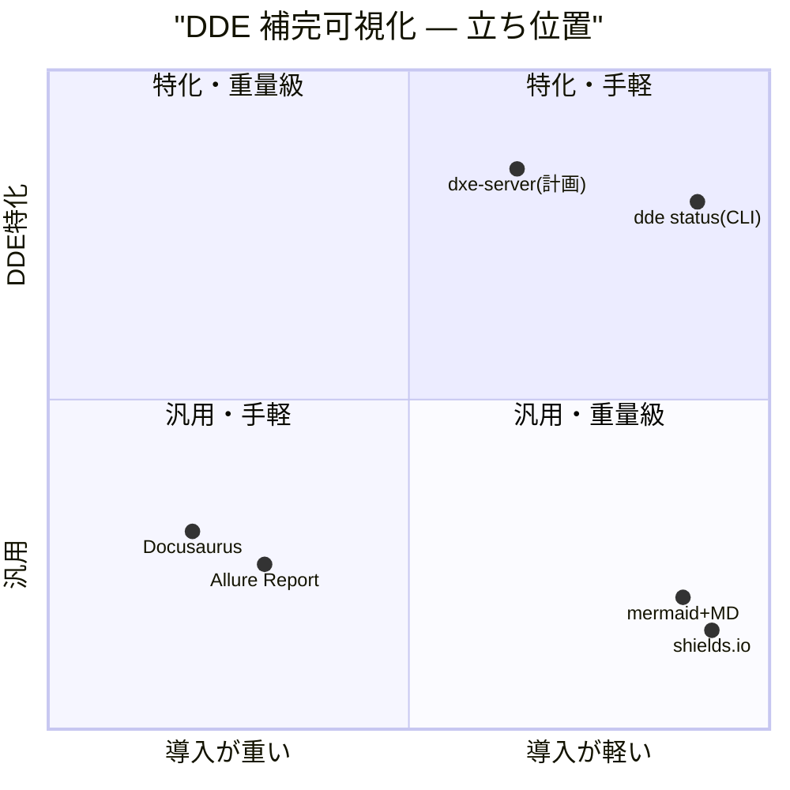
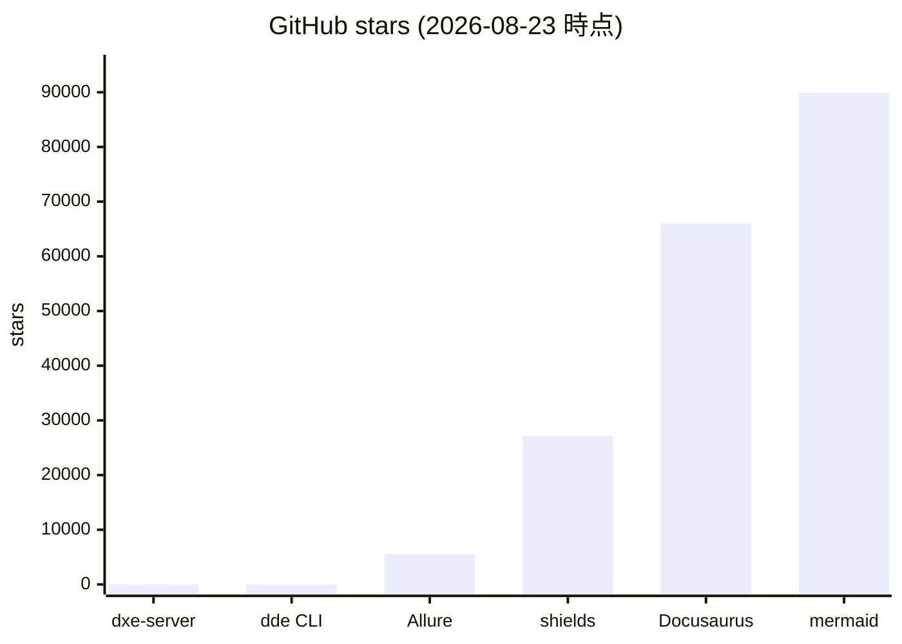

## 0. 要約

- **立ち位置**: DxE シリーズの可視化アドオンを意図した scaffold-only リポジトリ。実行コードは一行もなく、ADR-002（DVE に吸収する／独立サーバにする／CLI にする）が未決定のため、リポジトリ自体の存廃すら未確定。
- **最大の弱点**: スコープ未確定のうえ、前提となる DDE 側の `completion.json` 出力機能も未実装。dxe-server 単体では何も表示できない「二重に依存未解決」状態。
- **次の一手**: まず ADR-002 を決定すること。3ヶ月経過時点で scaffold のままなら Option A（DVE へ吸収・リポジトリ archive）が最もコスト低。独立サーバ（Option B）は「自作 vs 既製品」で勝ち目が薄い。

## 1. このrepoは何か

### 1.1 一言

`@unlaxer/dxe-server` は DxE ツールキットスイート（DGE/DDE/DVE/DRE）の状態を可視化するローカルサーバ／CLI を意図した npm パッケージの **scaffold** である。`bin/dxe-server.js` が `package.json` に宣言されているが **ファイルは存在せず**、`src/` ディレクトリもない。実行可能コードはゼロ行。

### 1.2 提供価値（意図）

DxE シリーズが蓄積する状態のうち、**DDE ドキュメント補完状態**（どのページが完成か、どの用語が未リンクか）を可視化し、週次レポートとして出力すること。これは同じシリーズの DVE（決定グラフ可視化、`localhost:4174` で稼働済）が `hasDDE: boolean` までしか持たない空白領域を埋めることを目指す。

README が「DDE 状態の可視化 + 週次レポート」と謳う一方、初期設計メモ（`design-materials/intake/initial-design.md`）は DRE ステート・DGE Gap ライフサイクル・マルチプロジェクトスキャンも想定していた。これらは **すべて DVE が既実装済み** であることが `docs/relationship-with-dve.md` で事後に判明し、スコープは DDE のみに縮小された。README と実態（scaffold）の乖離は小さいが、README と「防衛可能なスコープ」の乖離は大きい。

### 1.3 想定利用者

SPEC 付録 C.3 は4ペルソナを想定するが、いずれも **仮説** である（Critical Gap #3 未解決）:

| ペルソナ | 使用頻度 | 想定形態 |
|---|---|---|
| 個人開発者（1プロジェクト） | 週1 | Option C（`npx` 一発）が最適と推定 |
| チームリード（複数プロジェクト） | 日次 | Option B（常駐ダッシュボード） |
| マネージャー | 週次 | Option C（CI で Markdown 生成） |
| CI エンジニア | PR ごと | Option C（`dxe-server report`） |

### 1.4 到達点の客観指標（2026-08-23 確認）

| 指標 | 値 | 出典 |
|---|---|---|
| テスト数 | 0 | `src/`・`test/` ディレクトリ不存在 |
| LOC（実装） | 0 | `bin/dxe-server.js`・`src/` なし |
| npm 公開 | 未公開 | `package.json` version 0.1.0、`files` 未定義 |
| 公開 URL | なし | localhost:4175 は計画のみ |
| 稼働状況 | 非稼働 | scaffold のみ |
| 最終コミット | 2026-08-03 | `git log` HEAD `7db8e84` |
| 最終 push | 2026-08-03 | `gh repo view` |
| GitHub stars | 0 | `gh api` |
| ライセンス | MIT（`package.json` 宣言、LICENSE ファイルは未確認） | `package.json` |
| 依存パッケージ | 0 | `package-lock.json`（自身のみ） |

## 1.5 調査の型 — `internal`

このリポジトリは自家用基盤である。作者は同一人物（opaopa6969）が DxE-suite も管理し、dxe-server はその一部として設計している。公開利用者を想定しているが、現状は個人プロジェクトの枠内。

`internal` 型の問いは「どう勝つか」ではなく **「作らずに済ませられるか」** である。したがって:

- **2節** は「dxe-server を置き換えられる既製品」を探す（勝つためではなく、**捨てるため**）
- **4節** は既製品にあって dxe-server（計画）に無い機能ではなく、**dxe-server にあって既製品では satisfied できない要件**を並べる。これが無ければ自作の正当性が無い
- **6節** の提案は「置き換える／自作を続ける（その理由）／一部だけ既製品に寄せる」の判断。自作を続ける理由が「愛着」しか出てこないなら、それは置き換えるべきという結論

なお、scaffold-only で実行コードがないため、`library`/`engine` のように「コードを読んで比較する」ことはできない。本調査は **計画文書（SPEC 1572行・ADR・設計メモ）を読み、計画段階での「自作 vs 既製品」を判断する** という限界がある。`confidence: 低` はこれによる。

## 2. 比較対象と選定理由

「DDE 補完状態を可視化し、週次レポートを出力する」仕事を置き換える既製品を探す。dxe-server は **DDE が出力する（予定の）`completion.json` を読んで表示する** のが本質なので、比較対象は「JSON を読んでダッシュボード／レポートを出す汎用ツール」と「そもそも dxe-server を作らず CLI 一発で済ませる」の2系統。

| 製品 | 何ができるか | 採用状況 | ライセンス | うちとの決定的な違い | なぜ選んだか |
|---|---|---|---|---|---|
| Allure Report | テスト結果JSONから多言語対応のダッシュボードを生成。CI 統合、静的HTML出力、時系列トレンド標準装備 | ★5,506 / push 2026-08-21 / Apache-2.0 | Apache-2.0 | テスト結果向けに固定化。DDE補完率という「継続的メトリクス」を入れるにはスキーマ拡張が要る | 「JSON → ダッシュボード + 履歴」の定番。dxe-server が目指す領域の先行実装 |
| shields.io | JSON エンドポイントからバッジ画像を動的生成。`https://img.shields.io/static/v1?label=...&message=73%25&color=green` の1行で補完率表示 | ★27,092 / push 2026-08-21 / Apache-2.0 | Apache-2.0 | 「バッジ1枚」しか出ない。ダッシュボード・未完成ページ一覧は不可 | 最小コストの「補完率 可視化」。dxe-server の UI 要件がどこまで小さくできるかの下限 |
| Docusaurus | 静的ドキュメントサイト生成。プラグインでカスタムページ追加可。バージョン管理されたドキュメント群を整理 | ★66,041 / push 2026-08-21 / MIT | MIT | 「サイト全体」を作る工具。DDE 補完率1ページのためだけに導入するのは過大 | DDE が生成する用語記事群をホストする本来の用途と、補完率ダッシュボードを兼ねられるか |
| upload-artifact (GH Actions) | CI の成果物を PR に添付。Markdown・HTML・画像をそのまま残せる | ★4,167 / push 2026-04-14 / MIT | MIT | 「保存」しかしない。集計・描画は自作 | Option C（週次レポート）の配布チャネル。dxe-server が作るべき物のうち「配布」部分を既製品で代替できるか |
| mermaid | Markdown に埋め込める図（xychart・pie・flowchart）。GitHub がネイティブ描画 | ★89,889 / push 2026-08-21 / MIT | MIT | 図を描くだけ。データ集計は別 | 週次 Markdown レポートに「補完率推移グラフ」を埋め込む最小手段。dxe-server が Chart.js を導入する意義を問う |
| `dde status` (CLI) | DDE-toolkit が既に出せるはずの `completion.json` を CLI で読んでターミナル表示。dxe-server とは別リポジトリで未実装 | ★0 / DxE-suite は ★0 / MIT | MIT | dxe-server が目指すものの **最も小さな形**。これで十分ならサーバもCLIツールも不要 | 「dxe-server を作らない」という選択肢の具体形。Critical Gap #2/#3 が「単一プロジェクト・週1」であればこれで足りる |

### どういう地図なのか

この領域は「決定的な標準」が無い。Allure はテストレポートに強いが、ドキュメント補完率という「継続的に変化するメトリクス」を乗せることは想定していない。shields.io はバッジ1枚の世界で、ダッシュボードを作らない。Docusaurus はサイト全体を作る工具で、1ページのために導入するには重い。

つまり **「JSON メトリクス → 小さなダッシュボード＋週次レポート」のニッチは空洞** である。Allure が最も近いが、テスト結果という独自のデータモデルに固定されているため、DDE の `completion.json`（ページ別補完率・未リンク用語）をそのまま乗せることはできない。dxe-server が差別化を主張できるのは「DDE 補完状態というデータモデルに特化した可視化」一点のみ。

ただし、この差別化は **「データモデルに特化したビューア」以上のものではなく、Allure のプラグイン拡張や Docusaurus のカスタムページでも代替可能** な薄い層である。Critical Gap #2（マルチプロジェクト横断集約の価値）が未証明のままでは、この差別化が独立パッケージを正当化するかは疑わしい。

## 3. ポジショニング（図）

データが揃っているため描画する。軸は「導入の重さ」と「DDE特化度」。

````

````

x軸: 導入コスト（依存数・セットアップ手間）。y軸: DDE 補完状態というデータモデルへの特化度。

dxe-server（計画）は右上「特化・比較的手軽」を狙うが、**scaffold なので座標は計画値**。`dde status` CLI は dxe-server が目指す領域の最も小さな形で、ほぼ同じ位置にいる。汎用ツール群は左下〜右下に散らばり、DDE 特化の右上は **dxe-server と未実装の CLI だけ** という孤立状態。

## 4. 機能比較

重み列を付ける。dxe-server の「防衛可能なスコープ」（SPEC §2.1: F-01 DDE補完状態ビュー / F-02 週次レポート / F-03 プロジェクト登録）を基準に、各機能がその立ち位置で必須か効くかを判断する。

| 機能 | 重み | dxe-server(計画) | Allure | shields.io | Docusaurus | upload-artifact | mermaid+MD | `dde status` CLI |
|---|---|---|---|---|---|---|---|---|
| DDE 補完率ダッシュボード | ◎必須 | ○(計画) | △(要拡張) | ×(バッジのみ) | △(自前ページ) | × | ×(静的) | △(ターミナル) |
| ページ別補完状態 | ○効く | ○(計画) | △(要拡張) | × | △(自前) | × | × | △(テキスト表) |
| 未リンク用語一覧 | ○効く | ○(計画) | × | × | △(自前) | × | × | △(テキスト) |
| 週次 Markdown レポート | ◎必須 | ○(計画) | △(HTML中心) | × | × | △(配布のみ) | △(自前描画) | ○(stdout) |
| 週次 HTML レポート | △あれば | ○(計画) | ○ | × | × | △(配布) | △ | △(`--format html`可) |
| 補完率時系列トレンド | ○効く | ○(計画) | ○(標準) | × | △(自前) | × | △(手書き) | ×(履歴なし) |
| マルチプロジェクト集約 | ○効く | ○(計画) | ○(標準) | △(複数バッジ) | △(自前) | × | × | △(ループ) |
| CI 統合（PR添付） | ○効く | △(Option C) | ○(標準) | ○(標準) | △ | ○(標準) | ○ | △(自前) |
| ブラウザ UI | △あれば | ○(Option B) | ○ | × | ○ | × | × | × |
| プロジェクト登録管理 | △あれば | ○(計画) | × | × | △(設定) | × | × | △(設定) |
| DVE との共存ガイド | ◎必須 | ○(計画) | × | × | × | × | × | △(委譲明示) |
| 実装コード存在 | ◎必須 | **×** | ○ | ○ | ○ | ○ | ○ | **×** |

凡例: ○=ある / △=部分的・要設定 / ×=無い ／ 重み: ◎=この立ち位置で必須 / ○=効く / △=あれば良い / —=不要

### ×のうち痛いもの

**「実装コード存在」が×であることが最も痛い。** dxe-server は他の全機能で○を取っていても、この1項目が×である時点で **比較にならない**。Allure・shields・mermaid は今日動き、dxe-server は今日動かない。これは「計画段階の比較」であるという本調査の限界そのものである。

次に痛いのは「CI 統合」が△であること。Option C（レポートジェネレータ）が推奨出発点とされる一方で、CI 統合は標準装備ではなく `--format` オプションで自前対応になる。Allure は CI 統合が標準であり、upload-artifact と組み合わせれば PR への添付が自動である。dxe-server が Option C を選んでも、この点では既製品の後追いになる。

### ○のうち実は差別化になっていないもの

「マルチプロジェクト集約」は dxe-server が○を主張するが、Allure も標準で持つ。Critical Gap #2 が「マルチプロジェクト集約こそサーバの本質価値」とするなら、それは **Allure が既に持っている価値** であり、dxe-server の差別化にはならない。差別化は「DDE 補完状態というデータモデルへの特化」のみ。

「補完率時系列トレンド」も Allure が標準装備。「dxe-server が初めて可視化する」という SPEC §5.1 の主張は、**汎用ツールの文脈を無視している**。Allure に DDE 用のプラグインを書けば、トレンドもダッシュボードも得られる。

## 4.5 コード・実装の比較

dxe-server は実装コードがないため、通常の `library`/`engine` のように「API数・依存数・テスト量」を比較することはできない。代わりに **計画された依存構成（SPEC §9.2）と既製品の実態** を対比する。

| 観点 | dxe-server(計画) | Allure | shields.io | 出典 |
|---|---|---|---|---|
| 実行コード | **0行** | Java/Kotlin（gradle マルチモジュール） | Node.js | `ls src/ bin/`・Allure README・shields README |
| 計画依存 | marked or remark, Preact, Vite, Chart.js or D3 | Java 8+ ランタイム | Node.js | SPEC §9.2 |
| テスト | 0（計画は Vitest） | gradle test（数不明） | テストスイート存在 | `package.json`・Allure build.gradle |
| 配布サイズ | 未公開 | CLI zip 100MB超（Java起動） | npm パッケージ | npm 未公開・Allure releases |
| ライセンス制約 | MIT | Apache-2.0 | Apache-2.0 | `package.json`・各 LICENSE |

dxe-server の「軽量・Node.js only・依存最小」は計画上の強みだが、**Allure は重くても動き、dxe-server は軽くても動かない**。計画段階の「軽さ」は実装されて初めて強みになる。SPEC が「Option C であれば永続化層不要・実行時にファイルを直接読む」とする方針は正しいが、それは **`dde status` CLI とほぼ同じ** であり、独立パッケージにする根拠が薄い。

## 5. 採用状況（図）

star 数が揃っているため描画する。ただし dxe-server は 0 である。

````

````

dxe-server は★0、DxE-suite 全体でも★0。比較対象は数千〜数万のstarを持つ。ただし internal 型では star 数は「勝ち負け」の指標ではなく、**「この領域に既製品が充実しているか」の傍証** である。mermaid 9万・Docusaurus 6.6万・shields 2.7万・Allure 5.5千は、**「JSONメトリクスを可視化する汎用ツール」が既に普及しきっている** ことを示す。この地盤の上に DDE 特化の薄いビューアを1つ足すことは、既製品の隙間を埋める意義があるかの問いに直面する。

## 5.5 調査者の見立て

### 何が本当の勝負所か

機能比較表の○×ではなく、**ADR-002 を決めること** が勝負所である。3つの選択肢（DVE吸収／独立サーバ／CLI）は実装コストが桁違いで、しかも Option A（DVE吸収＝リポジトリarchive）は「作らない」という選択である。dxe-server が「何を実装するか」を議論する前に、「そもそも実装するか」を決めないと、SPEC の1572行はすべて空中に浮く。

次に、**DDE 側が `completion.json` を出力するか** が勝負所。dxe-server の全機能はこの1ファイルに依存し、それは DDE-toolkit（DxE-suite 内 `dde/kit/`）側の未実装機能である。dxe-server が Option B/C で実装されても、DDE 側が動かないと何も表示できない。これは「自作 vs 既製品」ではなく「他の自作リポジトリの完了を待つか」という依存関係の問題で、市場調査の枠を超える。

### 数字に出ていないが気になること

SPEC は極めて詳細（1572行・付録 J まで）だが、**実装コードが1行もない**。設計の完璧さと実装の不在の対比は、作者が「設計で考えているうちは楽しいが、書き始めると ADR-002 の判断が先に要ることに気づいた」可能性を示唆する。事実、CHANGELOG の最終更新は 2026-04-04（scaffold 作成）、最終 push は 2026-08-03 だがそれは `package-lock` の CI キャッシュ対応であり、機能追加ではない。**4ヶ月間、scaffold のままである**。

DVE との重複分析（`relationship-with-dve.md`）は極めて誠実である。「DVE が既に実装済み」「dxe-server の防衛可能スコープは DDE のみ」「Option A が選ばれればリポジトリ自体が廃止」と、自分にとって不利な事実を隠さず書いている。この文書の質は高い。だが、それは同時に **「自分で書いていて、このリポジトリを続ける根拠が薄いことに気づいている」** とも読める。

### 自分ならどうするか

私なら **Option A（DVE へ吸収・リポジトリ archive）** を選ぶ。理由は3つ:

1. DVE は Preact + Cytoscape の可視化インフラを持ち、DDE 補完率のダッシュボードを「新ビュー」として追加する方が、独立サーバを1から立てるより安い
2. Critical Gap #2（マルチプロジェクト集約の価値）は DVE の `/api/scan` が既に解決している。dxe-server が同じ機能を再実装するのは二重投資
3. DDE 補完率の「週次レポート」は、DVE に「エクスポート」機能として追加するか、CI で `dde status --json | mermaid` を回す方が、独立パッケージをメンテするより安い

dxe-server リポジトリは、ADR-001（独立パッケージ化）の時点では「将来のチーム共有サーバ化」を見込んでいたが、4ヶ月経過しても scaffold のままである。将来を見込んだ分離のコストを、今すでに払っている。

### この見立てが外れるとしたらどこか

- **DVE が DDE 補完率ビューの追加を拒否した場合** — DVE は別リポジトリ（DxE-suite）で、DDE 補完は dxe-server の責務と合意されている。DVE 側に追加するコストがかかるため、Option A は「DVE 側の合意」に依存する。これが得られなければ Option B/C が復活する
- **DDE `completion.json` が DDE-toolkit 側で実装された場合** — dxe-server の最大の依存未解決が解け、Option B/C の実装が一気に現実的になる。このとき既製品比較の結論は変わる
- **複数プロジェクト横断で「チーム全体のDDE補完率」を見る需要が実在した場合** — Critical Gap #2 が解かれ、独立サーバ（Option B）の根拠が生まれる。現在は仮説だが、これが観測されれば私の Option A 推しは覆る
- **3ヶ月以内に scaffold から実装に移った場合** — この見立ては「scaffold が放置されている」を前提とする。実装が始まれば前提が崩れる

## 6. 提案

「あったら良い」ではなく、この立ち位置から次にやるべき順。**やらない提案を必ず1つ以上** 含む。

| 順 | 提案 | 分類 | 根拠 | 最小の一手 | 効きそうな指標 |
|---|---|---|---|---|---|
| 1 | **ADR-002 を Option A（DVE吸収）で決定する** | やらない | 4.5節: 実装コード0・4ヶ月 scaffold 放置・DVE 既実装・SPEC 自身が「Option A は最もコスト低」と示唆 | ADR-002 の Status を `Accepted — Option A` に書き換え、README に archive 予定を1行追加 | リポジトリ archive 完了 |
| 2 | **DVE に「DDE 補完率ビュー」を追加する PR を出す** | 埋める | 4節: DVE が Preact+Cytoscape を持ち、dxe-server の計画面積の大部分を既に持つ。重複実装を避ける | DVE の `dve/app/src/` に `DdeCompletionView.tsx` を1ファイル追加し、`completion.json` を読む | DVE の `/dde` ルートが動く |
| 3 | **DDE-toolkit 側で `completion.json` 出力を実装する** | 埋める | 1節: dxe-server の全機能がこの1ファイルに依存し、未実装。Option A/B/C いずれでも必要 | `dde/kit/bin/dde status --json > dde/completion.json` を1コマンド追加 | `completion.json` が生成される |
| 4 | **週次レポートは `dde status --json \| mermaid` の CI job で済ませる** | やらない | 4.5節: upload-artifact + mermaid で配布も描画も既製品がカバー。dxe-server のレポート生成は車輪の再発明 | `.github/workflows/dde-weekly.yml` を1ファイル追加し、`dde status --json` を mermaid 付 Markdown に変換して artifact 添付 | PR に週次レポートが自動添付される |
| 5 | **dxe-server リポジトリを archive する** | やらない | 提案1〜4で dxe-server が担う予定だった機能はすべて既製品 or DVE に移る。リポジトリ維持コストだけが残る | GitHub の Archive ボタンを押す。README に「DVE に統合」の1行を残す | リポジトリが Read-only 化 |

### やらない提案の理由（本体）

提案1（Option A採用）と提案5（archive）は「dxe-server を作らない」という結論である。これを「やらない」に分類したのは、本調査の型が `internal` であり、internal の問いが「作らずに済ませられるか」だから。**自作を続ける理由が「愛着」しか出てこないなら、それは置き換えるべき** という書式の指針に従う。

dxe-server を作る理由として残るのは「DDE 補完状態に特化した独立した UX」のみだが、それは DVE の新ビューとして実装可能（提案2）であり、独立パッケージを要しない。ADR-001 が「将来のチーム共有サーバ化」を見込んだ独立化は、4ヶ月の scaffold 放置によって「将来」が来ないことを示した。

提案4（CI で済ませる）も「やらない」に分類した。これは「dxe-server の Option C（レポートジェネレータ）を作る」ことを放棄する提案である。`dde status --json` と mermaid と upload-artifact の組み合わせが、Option C が目指す成果物を **既製品だけで** 生成する。Option C は ADR-002 で「Gap #3 を回避できる」と推奨されたが、その推奨は「dxe-server という CLI を作る」前提であり、「既存の `dde status` で十分」は考慮外であった。

## 8. 出典

| URL | 参照日 | 何の根拠に使ったか |
|---|---|---|
| https://github.com/opaopa6969/dxe-server | 2026-08-23 | 自repo。stars 0・push 2026-08-03・HEAD 7db8e84・scaffold only |
| https://github.com/opaopa6969/DxE-suite | 2026-08-23 | DVE/DDE/DGE/DRE の正規実装所在。stars 0・push 2026-08-22。dxe-server が依存する `completion.json` はここ（`dde/kit/`）で未実装 |
| 本repo `README.md` / `README-ja.md` | 2026-08-23 | 「DDE可視化 + 週次レポート」の意図・scaffold 状態 |
| 本repo `docs/architecture.md` | 2026-08-23 | DVE との責務分担・Critical Gap #2/#3 |
| 本repo `docs/relationship-with-dve.md` | 2026-08-23 | DVE 既実装機能・dxe-server の空白領域 |
| 本repo `docs/decisions/ADR-002-scope-options.md` | 2026-08-23 | Option A/B/C の詳細・Status: OPEN |
| 本repo `spec/SPEC.md` (1572行) | 2026-08-23 | 計画API・データモデル・ペルソナ・ロードマップ・付録C判断マトリクス |
| 本repo `design-materials/intake/initial-design.md` | 2026-08-23 | 初期DGEセッション・ADR-001理由・Gap #2/#3 起源 |
| 本repo `package.json` / `package-lock.json` | 2026-08-23 | 依存0・MIT・Node>=18・bin未作成 |
| https://github.com/allure-framework/allure2 | 2026-08-23 | stars 5506・Apache-2.0・push 2026-08-21・テストレポートツール |
| https://github.com/badges/shields | 2026-08-23 | stars 27092・Apache-2.0・push 2026-08-21・動的バッジ生成 |
| https://github.com/facebook/docusaurus | 2026-08-23 | stars 66041・MIT・push 2026-08-21・静的ドキュメントサイト生成 |
| https://github.com/actions/upload-artifact | 2026-08-23 | stars 4167・MIT・push 2026-04-14・CI 成果物添付 |
| https://github.com/mermaid-js/mermaid | 2026-08-23 | stars 89889・MIT・push 2026-08-21・Markdown埋め込み図 |
| https://shields.io/ | 2026-08-23 | shields.io 公式サイト・badge-maker npm の確認 |
| https://github.com/opaopa6969/DDE-toolkit | 2026-08-23 | archived（DxE-suite に統合済み）・stars 0 |

### confidence が「低」である理由

`internal` 型ではコードが読めることが強みだが、本リポジトリは scaffold-only で **読むべき実装コードが存在しない**。比較対象（Allure・shields 等）も **実際に動かしてはいない**（公開URL触らず、README・star数・最終更新日・ライセンスの客観指標のみ）。したがって「高」の条件（コードを読んだ／動かした記録）を満たさず、「低」の条件（二次情報主）に相当する。Allure の README は読んだが、Allure のプラグイン拡張で DDE 補完率が乗るかは未検証である。

## 9. 前回からの差分

（初回調査のため差分なし）
